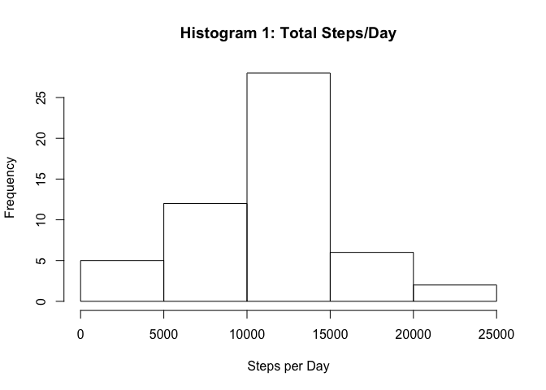
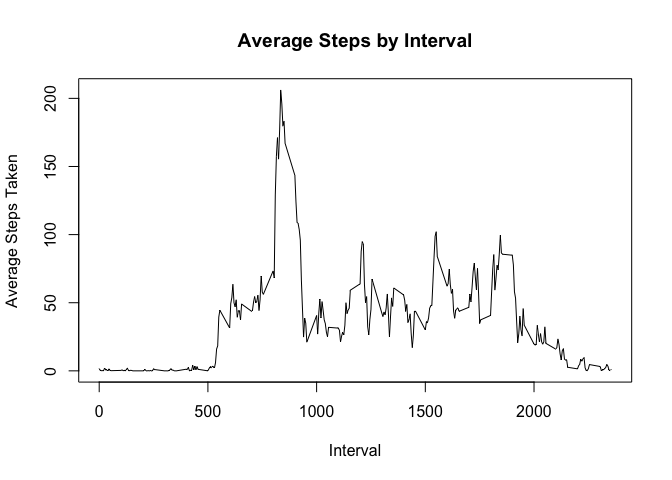
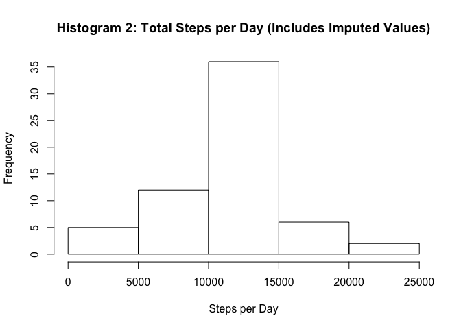
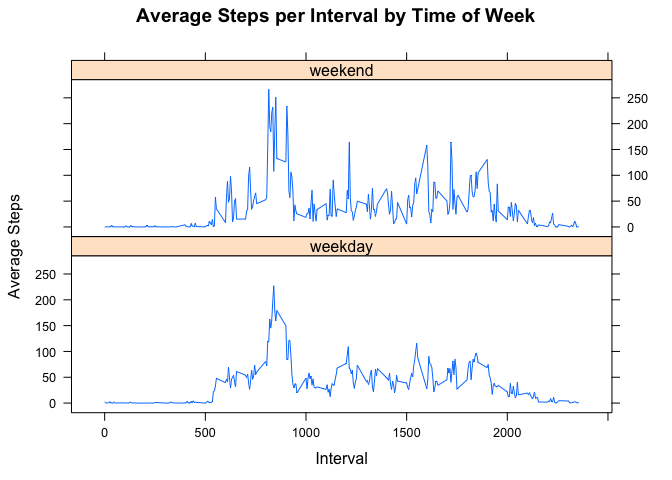

1. First, let's download and read the raw data.
-----------------------------------------------

``` r
data <- "https://d396qusza40orc.cloudfront.net/repdata%2Fdata%2Factivity.zip"
if(!file.exists("./data")){dir.create("./data")}
filedownload <- download.file(data,destfile="./data/ActivityMonitoring_Steps.zip")
stepsdata <- unzip("./data/ActivityMonitoring_Steps.zip")
stepsdata <- read.csv(stepsdata,header=TRUE,sep=",")
```

2. Now we need to remove missing values and calculate the total number of steps per day for use in our histogram.
-----------------------------------------------------------------------------------------------------------------

``` r
library(dplyr)
stepsdata_byday <- group_by(stepsdata,date)
stepsdata_byday <- filter(stepsdata_byday,steps != "NA")
stepsdata_byday <- summarise(stepsdata_byday,sum(steps, na.rm = TRUE))
stepsdata_byday <- rename(stepsdata_byday, Date = date, Daily_Steps = `sum(steps, na.rm = TRUE)`)
```

### With the data cleaned and processed we are ready to plot.

``` r
hist(stepsdata_byday$Daily_Steps,xlab="Steps per Day",main="Histogram 1: Total Steps/Day")
```



### Finally, let's calculate the mean and median steps per day.

``` r
mean(stepsdata_byday$Daily_Steps)
```

    ## [1] 10766.19

``` r
median(stepsdata_byday$Daily_Steps)
```

    ## [1] 10765

RESULT: The mean steps taken each day are 10766.19. The median steps taken each day are 10765. Pretty close!

3. Now we need to find the average daily activity pattern.
----------------------------------------------------------

### First we need to group ny interval.

``` r
stepsinterval <- group_by(stepsdata,interval)
stepsinterval <- filter(stepsinterval,steps != "NA")
stepsinterval <- summarise(stepsinterval,mean(steps))
```

### Now we are ready to plot.

``` r
plot(stepsinterval, xlab="Interval",ylab="Average Steps Taken",type="l",main="Average Steps by Interval")
```



### Finally, we can calculate the max.

``` r
stepsinterval <- rename(stepsinterval, Mean_Steps = `mean(steps)`)
stepsinterval <- arrange(stepsinterval,desc(Mean_Steps))
stepsinterval[1,]
```

    ## # A tibble: 1 x 2
    ##   interval Mean_Steps
    ##      <int>      <dbl>
    ## 1      835   206.1698

RESULT: The maximum average steps taken is 206, taken at interval 835.

4. Let's find out how much data is missing, impute the missing missing values and make a new histogram.
-------------------------------------------------------------------------------------------------------

``` r
sum(is.na(stepsdata$steps))
```

    ## [1] 2304

There are 2304 missing values.

### Let's impute the missing values to make a new dataset named datacopy.

We will use our pre-calculated interval means table (stepsinterval) to fill in the NA values.

``` r
library(imputeTS)
datacopy <- stepsdata
datacopy <- merge(datacopy,stepsinterval,by.x="interval")
datacopy <- arrange(datacopy,date)
datacopy$steps <- na.replace(datacopy$steps,fill=datacopy$Mean_Steps)
```

    ## Warning in na.replace(datacopy$steps, fill = datacopy$Mean_Steps): number
    ## of items to replace is not a multiple of replacement length

``` r
datacopy <- select(datacopy, interval,date,steps) 
```

### Let's check to make sure there are no more missing values in our new table.

``` r
sum(is.na(datacopy$steps))
```

    ## [1] 0

### Now we need to make our histogram.

``` r
datacopy <- group_by(datacopy, date)
stepsbyday <- summarize(datacopy,sum(steps))
hist(stepsbyday$`sum(steps)`,xlab="Steps per Day",main="Histogram 2: Total Steps per Day (Includes Imputed Values)")
```



### And calculate our mean and median number of steps per day.

``` r
mean(stepsbyday$`sum(steps)`)
```

    ## [1] 10766.19

``` r
median(stepsbyday$`sum(steps)`)
```

    ## [1] 10766.19

RESULT: The mean and median are equivalent to each other and the days in which all values were imputed for NA. The mean remains the same as it did in Histogram 1 but the median differs slightly. Imputing missing values caused our median to shift.

5. Let's figure out if there are differences in activity patterns between weekends and weekdays.
------------------------------------------------------------------------------------------------

### First we need to figure out the days of the week for each observation and create a factored column.

``` r
datacopy$date <- as.Date(as.character(stepsbyday$date))
stepsbyweekday <- mutate(datacopy,Weekday = weekdays(date))
daysofweek <- unique(stepsbyweekday$Weekday)
stepsbyweekday$Weekday <- factor(stepsbyweekday$Weekday,levels=c(daysofweek),ordered = TRUE)
stepsbyweekday <- mutate(stepsbyweekday, DayNo. = as.integer(Weekday))
stepsbyweekday <- mutate(stepsbyweekday,DayClass = if_else(DayNo.>5,"weekend","weekday"))
stepsbyweekday$DayClass <- as.factor(stepsbyweekday$DayClass)
stepsbyweekday <- arrange(stepsbyweekday,date,interval)
stepsbyweekday <- group_by(stepsbyweekday,DayClass,interval)
```

### Next we need to find the average activity for each interval on Weekdays and Weekends.

``` r
averagesteps <- group_by(stepsbyweekday,interval,DayClass)
averagesteps <- summarize(averagesteps,mean(steps))
```

### Now we're ready to plot.

``` r
library(lattice)
xyplot(`mean(steps)`~interval|DayClass,data=averagesteps,layout=c(1,2),type="l",main="Average Steps per Interval by Time of Week",ylab="Average Steps",xlab="Interval")
```



RESULT: The subject appears to be more active on weekends. We could hypothesize that this is when they are away from their weekly desk job. The subject also appears to stay up a little bit later on weekends, as shown by the spike in activity at the tail of the weekend data.
